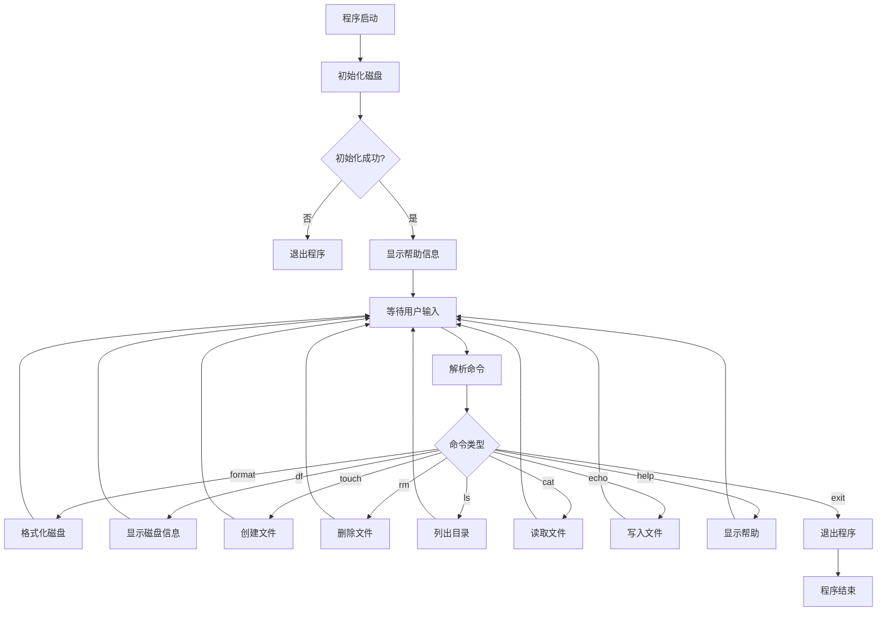
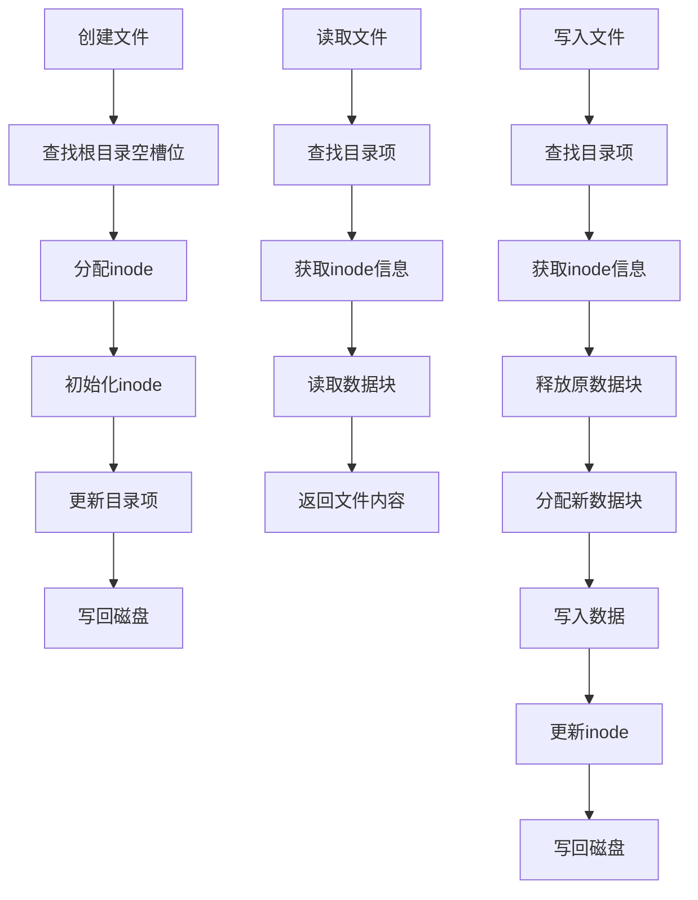

# FileSys - 简单文件系统模拟器

这是一个用C语言实现的简单文件系统模拟程序，旨在演示基本的文件系统操作和磁盘管理机制。

## 项目概述

### 项目背景
FileSys 是一个用C语言实现的简单文件系统模拟程序，旨在演示基本的文件系统操作和磁盘管理机制。

### 核心问题

模拟底层磁盘存储管理和文件操作（如创建、读写、删除等），帮助理解文件系统内部工作原理。

## 模块框架设计

这个文件系统模拟器由三个主要模块组成：

1. **主控模块(main.c)**：
   - 用户界面处理
   - 命令解析和分发
   - 程序初始化和终止

2. **磁盘管理层(disk.c/disk.h)**：
   - 磁盘镜像文件管理
   - 块级读写操作
   - 磁盘元数据管理（超级块、位图等）

3. **文件操作层(file_ops.c/file_ops.h)**：
   - 文件系统操作实现
   - 文件和目录管理
   - inode和数据块分配/释放

模块间关系如下：
```
+------------+
|  main.c    | (用户接口层)
+-----+------+
      |
      v
+------------+
| file_ops.c | (文件系统逻辑层)
+-----+------+
      |
      v
+------------+
|  disk.c    | (磁盘存储层)
+------------+
```

## 流程图

### 程序主流程：



### 文件读写流程：


## 核心数据结构

### 1. 磁盘相关结构体

#### inode_t (索引节点)
```c
typedef struct {
    uint32_t size;        // 文件大小
    uint16_t type;        // 文件类型 (1: 普通文件, 2: 目录)
    uint16_t links;       // 链接计数
    uint32_t blocks[8];   // 直接数据块指针 (最多8个块)
} inode_t;
```

#### superblock_t (超级块)
```c
typedef struct {
    uint32_t magic;                  // 魔数标识
    uint32_t blocks;                 // 总块数
    uint32_t inode_blocks;           // inode区占用块数
    uint32_t data_blocks;            // 数据区可用块数
    uint32_t free_inode_count;       // 空闲inode数
    uint32_t free_data_count;        // 空闲数据块数
    char padding[BLOCK_SIZE - 6*sizeof(uint32_t) - sizeof(uint16_t)];
    uint16_t state;                  // 文件系统状态
} superblock_t;
```

#### filesystem_t (文件系统实例)

```c
typedef struct {
    FILE* file;                           // 磁盘映像文件句柄
    superblock_t superblock;              // 超级块缓存
    char inode_bitmap[INODE_BLOCKS * BLOCK_SIZE];  // inode位图缓存
    char data_bitmap[DATA_BLOCKS / 8];    // 数据块位图缓存
} filesystem_t;
```

### 2. 文件系统相关结构体

#### dir_entry_t (目录项)
```c
typedef struct {
    uint32_t inode;              // inode编号
    char name[MAX_FILENAME];     // 文件名
} dir_entry_t;
```

### 3. 全局变量

```c
filesystem_t fs;  // 全局文件系统实例
```

这些数据结构构成了整个文件系统的基石，其中：
- superblock_t存储全局元数据
- inode_t表示文件的元数据
- dir_entry_t连接文件名与inode
- filesystem_t维护运行时状态

该文件系统采用简单的连续分配方式，通过位图管理空闲inode和数据块，并限制每个文件最多使用8个直接数据块。

## 系统功能

### 主要功能:
- 磁盘模拟：通过 `disk.c` 实现虚拟磁盘的初始化与读写。
- 文件操作：通过 `file_ops.c` 提供文件的创建、打开、读取、写入、关闭和删除等功能。
- 主程序控制：`main.c` 提供入口，调用相关接口进行测试和验证。

### 关键特性:
- 使用内存模拟磁盘块。
- 支持基本的文件系统元数据管理（如 inode、目录结构等）。
- 可调试和扩展性强，适合教学用途。

## 技术架构

### 设计模式:
- 模块化设计：将功能划分为磁盘层（disk）、文件操作层（file_ops），实现分层抽象。
- 过程式编程：采用C语言的过程式风格组织代码逻辑。

### 主要组件交互:
- `main.c` 调用 `file_ops.c` 中的文件操作函数。
- `file_ops.c` 调用 `disk.c` 提供的底层读写接口来访问"磁盘"数据。
- `disk.c` 管理一块模拟的连续内存空间，代表物理磁盘。

## 技术选型
- 编程语言: C
- 编译器: GCC
- 标准: C99
- 构建工具: Make

## 开发环境
### 必需工具:
- GCC 编译器
- GNU Make
- 支持 C99 的开发环境（如 Linux、macOS 或 Windows + MinGW/WSL）

### 运行环境:
- 构建命令: `make` （生成 filesystem 可执行文件）
- 清理命令: `make clean` （删除目标文件和可执行文件）
- 本地开发: 直接编辑源码后使用 make 构建

## 使用说明

1. 构建项目:
   ```bash
   make
   ```

2. 运行程序:
   ```bash
   ./filesystem
   ```

3. 常用命令:
   - `format` - 格式化磁盘
   - `df` - 显示磁盘信息
   - `touch <文件名>` - 创建文件
   - `rm <文件名>` - 删除文件
   - `ls` - 列出目录内容
   - `cat <文件名>` - 读取文件内容
   - `echo <文件名>` - 写入文件内容
   - `help` - 显示帮助信息
   - `exit` - 退出程序

## 磁盘镜像管理机制

- 当 disk.img 文件不存在时，程序启动会自动创建新的 2MB 磁盘镜像文件
- 需执行 `format` 命令初始化文件系统结构（超级块、inode位图、数据块位图等）
- 完整流程：删除旧文件 → 启动程序 → 执行 format 命令