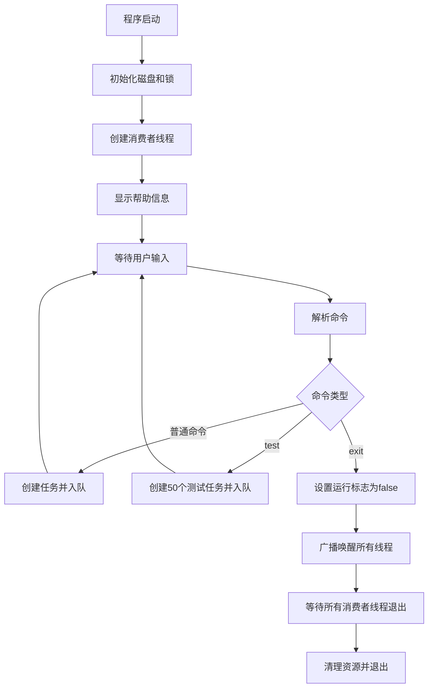
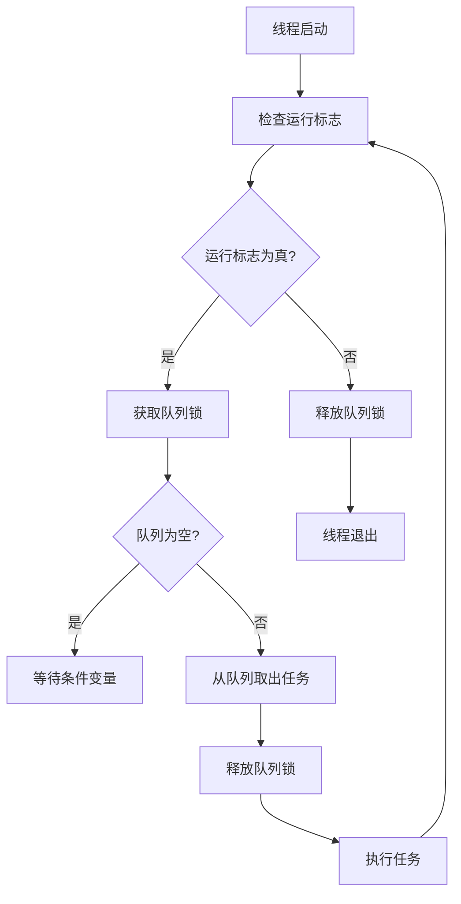
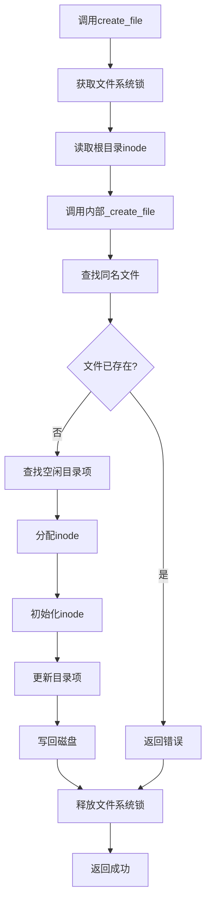

# FileSys - 多线程文件系统模拟器

## 模块框架设计

这个文件系统模拟器由三个主要模块组成：

1. **主控模块(main.c)**：
   - 用户界面处理
   - 命令解析和任务分发
   - 程序初始化和终止
   - 线程管理

2. **磁盘管理层(disk.c/disk.h)**：
   - 磁盘镜像文件管理
   - 块级读写操作
   - 磁盘元数据管理（超级块、位图等）

3. **文件操作层(file_ops.c/file_ops.h)**：
   - 文件系统操作实现
   - 文件和目录管理
   - inode和数据块分配/释放
   - 并发控制

模块间关系如下：
```
+------------------+
|     main.c       | (用户接口层 - 生产者)
+--------+---------+
         |
         | (任务队列)
         v
+------------------+     +------------------+
|  消费者线程1     | ... |  消费者线程N     |
+--------+---------+     +--------+---------+
         |                        |
         v                        v
+-------------------------------------------+
|            file_ops.c                     | (文件系统逻辑层)
|  (带锁API)                                |
+--------------------+----------------------+
                     |
                     v
+-------------------------------------------+
|            file_ops.c                     | (文件系统核心逻辑)
|  (无锁内部函数)                           |
+--------------------+----------------------+
                     |
                     v
+-------------------------------------------+
|              disk.c                       | (磁盘存储层)
+-------------------------------------------+
```

## 流程图

### 程序主流程：


### 消费者线程处理流程：


### 文件操作流程（以创建文件为例）：


## 核心数据结构

### 1. 多线程相关结构体

#### task_t (任务结构体)
```c
typedef struct {
    command_e cmd;          // 命令类型
    char arg1[MAX_ARG_LEN]; // 参数1
    char arg2[MAX_ARG_LEN]; // 参数2
    char content[1024];     // 文件内容（用于echo命令）
} task_t;
```

#### command_e (命令枚举)
```c
typedef enum {
    CMD_HELP,
    CMD_FORMAT,
    CMD_DF,
    CMD_TOUCH,
    CMD_RM,
    CMD_LS,
    CMD_CAT,
    CMD_ECHO,
    CMD_COPY,
    CMD_TEST, // 压力测试
    CMD_UNKNOWN
} command_e;
```

### 2. 磁盘相关结构体

#### inode_t (索引节点)
```c
typedef struct {
    uint32_t size;        // 文件大小
    uint16_t type;        // 文件类型 (1: 普通文件, 2: 目录)
    uint16_t links;       // 链接计数
    uint32_t blocks[8];   // 直接数据块指针 (最多8个块)
} inode_t;
```

#### superblock_t (超级块)
```c
typedef struct {
    uint32_t magic;                  // 魔数标识
    uint32_t blocks;                 // 总块数
    uint32_t inode_blocks;           // inode区占用块数
    uint32_t data_blocks;            // 数据区可用块数
    uint32_t free_inode_count;       // 空闲inode数
    uint32_t free_data_count;        // 空闲数据块数
    char padding[BLOCK_SIZE - 6*sizeof(uint32_t) - sizeof(uint16_t)];
    uint16_t state;                  // 文件系统状态
} superblock_t;
```

#### filesystem_t (文件系统实例)
```c
typedef struct {
    FILE* file;                           // 磁盘映像文件句柄
    superblock_t superblock;              // 超级块缓存
    char inode_bitmap[INODE_BLOCKS * BLOCK_SIZE];  // inode位图缓存
    char data_bitmap[DATA_BLOCKS / 8];    // 数据块位图缓存
} filesystem_t;
```

### 3. 文件系统相关结构体

#### dir_entry_t (目录项)
```c
typedef struct {
    uint32_t inode;              // inode编号
    char name[MAX_FILENAME];     // 文件名
} dir_entry_t;
```

### 4. 全局变量

```c
filesystem_t fs;                // 全局文件系统实例
pthread_mutex_t fs_lock;        // 文件系统全局锁
pthread_mutex_t queue_lock;     // 任务队列锁
pthread_cond_t queue_not_empty; // 队列非空条件变量
pthread_cond_t queue_not_full;  // 队列非满条件变量
```
